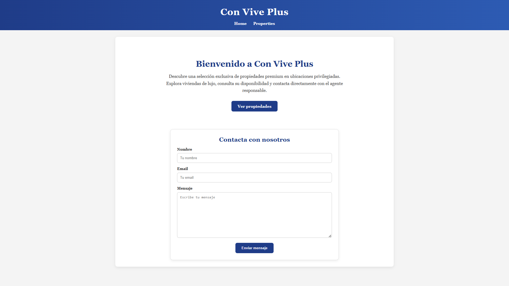
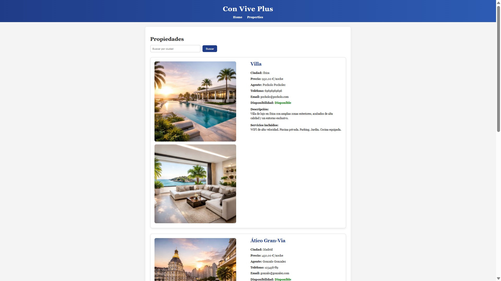
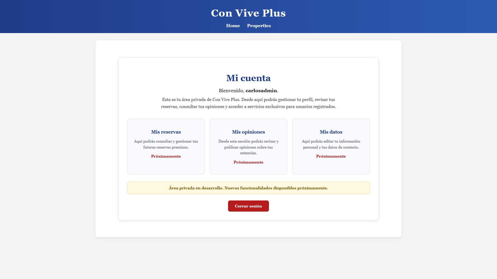

# Con Vive Plus

Con Vive Plus es una aplicación web desarrollada con Django orientada a propiedades premium. Permite visualizar alojamientos exclusivos, filtrarlos por ciudad, contactar con la empresa mediante un formulario y acceder a un área privada mediante registro y login.

Este proyecto está planteado como una base funcional sobre la que en futuras versiones se podrán añadir nuevas funcionalidades como reservas, opiniones de usuarios o asistentes inteligentes.

## Funcionalidades actuales

- Visualización de propiedades premium
- Filtrado de propiedades por ciudad
- Formulario de contacto en la página principal
- Guardado de mensajes en base de datos
- Registro de nuevos usuarios
- Inicio y cierre de sesión
- Área privada protegida para usuarios autenticados
- Panel de administración con Django Admin

## Tecnologías utilizadas

- Python
- Django
- SQLite
- HTML
- Django Templates

## Estructura general

El proyecto está organizado siguiendo la estructura básica de Django:

- models.py: definición de los modelos principales
- views.py: lógica de las vistas
- urls.py: rutas de la aplicación
- templates/: archivos HTML renderizados por Django
- forms.py: formularios basados en modelos (ModelForm)
- admin.py: configuración del panel de administración

## Modelos principales

### House
Modelo que almacena la información de las propiedades:
- nombre
- ciudad
- precio
- descripción
- disponibilidad
- servicios
- imágenes
- datos del agente

### ContactMessage
Modelo que almacena los mensajes enviados desde el formulario de contacto:
- nombre
- email
- mensaje
- fecha de creación

## Instalación y ejecución 
1. Clona el repositorio:
   
```bash
git clone URL_DEL_REPOSITORIO
cd PROYECTO_REAL
python -m venv venv
venv\Scripts\activate
pip install -r requirements.txt
python manage.py migrate
python manage.py runserver

## Próximas funcionalidades
- Sistema real de reservas
- Gestión completa del perfil de usuario
- Opiniones sobre propiedades
- Chatbot de asistencia al usuario

## Capturas del proyecto

### Home


### Properties


### My Account


## Autor
Carlos Ibáñez - Desarrollador backend en formación
